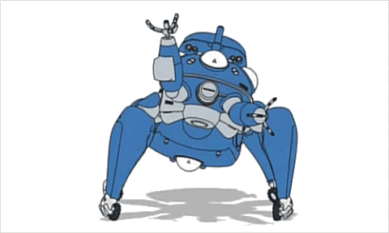

<h4 align="center"><samp> Hi, I'm Han and  welcome to my Github 👋 </samp></h4>
<h4 align="center"><samp>I'm a Fullstack Developer and a Home Foodie. I also like building things looks good ✨</samp></h4>

<!--
**ashhher/ashhher** is a ✨ _special_ ✨ repository because its `README.md` (this file) appears on your GitHub profile.

Here are some ideas to get you started:

- 🔭 I’m currently working on ...
- 🌱 I’m currently learning ...
- 👯 I’m looking to collaborate on ...
- 🤔 I’m looking for help with ...
- 💬 Ask me about ...
- 📫 How to reach me: ...
- 😄 Pronouns: ...
- ⚡ Fun fact: ...
-->

  

<samp>
Check out my repos ⬇️  
  </samp>

